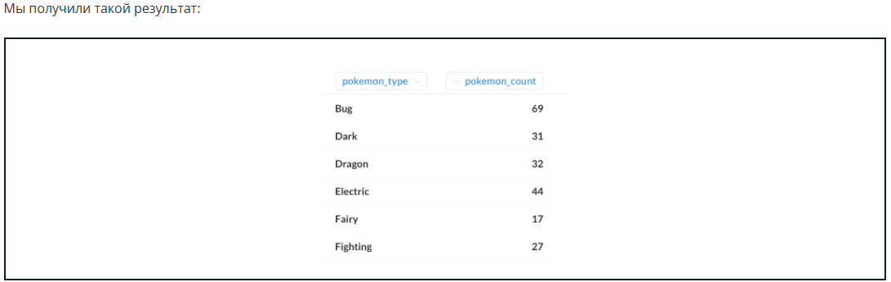
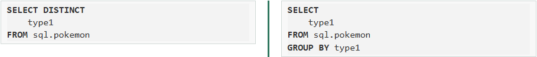

# Как мы помним, агрегатные функции вычисляют какой-то параметр для набора строк.

*Прежде мы применяли агрегатные функции для всего вывода, а сейчас используем для различных групп строк. Поможет нам в этом ключевое слово GROUP BY.*

*GROUP BY используется для определения групп выходных строк, к которым могут применяться агрегатные функции.*

*Выведем число покемонов каждого типа.*

**SELECT
    type1 AS pokemon_type,
    COUNT(*) AS pokemon_count
FROM sql.pokemon
GROUP BY type1
ORDER BY type1**

*Вывод, конечно же, можно сортировать по столбцу с агрегированием.*
*Представим ТОП существующих типов покемонов.*

**SELECT
    type1 AS pokemon_type,
    COUNT(*) AS pokemon_count
FROM sql.pokemon
GROUP BY pokemon_type
ORDER BY COUNT('звездочка') DESC**

***Обратите внимание! Мы использовали в группировке не название столбца, а его алиас.***

*Мы можем осуществлять группировку по нескольким столбцам.*

**SELECT
    type1 AS primary_type,
    type2 AS additional_type,
    COUNT(*) AS pokemon_count
FROM sql.pokemon
GROUP BY 1, 2
ORDER BY 1, 2 NULLS FIRST**

***Обратите внимание! В группировке можно указывать порядковый номер столбца так же, как мы делали это в прошлом модуле для сортировки.***

*GROUP BY можно использовать и без агрегатных функций. Тогда его действие будет равносильно действию DISTINCT.*

*Сравните выводы двух запросов:*
